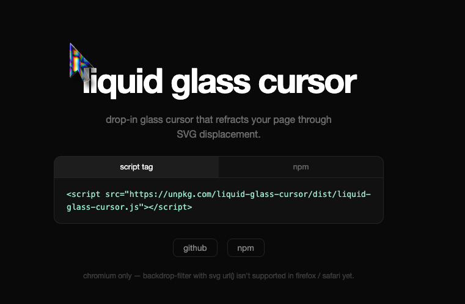

<h1 align="center">liquid glass cursor</h1>

<p align="center">


</p>

<p align="center">drop-in glass cursor that refracts your page through SVG displacement + backdrop-filter.<br>zero dependencies. chromatic aberration. physics-based motion.</p>

<p align="center">
  
</p>

<p align="center">
  <a href="https://liquid-glass-cursor-demo.vercel.app">live demo</a> &middot;
  <a href="https://www.npmjs.com/package/liquid-glass-cursor">npm</a> &middot;
  <a href="https://github.com/jassuwu/liquid-glass-cursor">github</a>
</p>

## install

**script tag** (easiest)

```html
<script src="https://unpkg.com/liquid-glass-cursor/dist/liquid-glass-cursor.js"></script>
```

**npm / bun**

```bash
npm i liquid-glass-cursor
```

```ts
import { createLiquidGlassCursor } from 'liquid-glass-cursor'

createLiquidGlassCursor()
```

## options

```ts
createLiquidGlassCursor({
  size: 2,            // scale factor
  scale: 30,          // max displacement in px (+ magnify, − pinch)
  border: 0.3,        // bevel width as fraction of shortest cursor dim
  outputBlur: 0.4,    // output filter blur
  frost: 0.06,        // frost tint opacity 0–1
  saturation: 1.2,    // saturation boost
  chromatic: {        // per-channel scale offsets for aberration
    r: 0,
    g: 2,
    b: 4,
  },
  lerp: 0.15,         // smooth follow 0–1 (lower = more lag)
})
```

## how it works

1. **Shape-aware displacement map** — for every pixel inside the cursor we compute its signed distance to the nearest edge and the outward unit normal. In the bevel zone (within `border` of the rim) the displacement vector is `outward_normal × smoothstep_profile(d/bevel)`, encoded as `R = 128 + 127·dx`, `B = 128 + 127·dy`. The flat interior stays neutral, so only the rim refracts — the same physics as a thick glass slab with a rounded edge.
2. **3-pass RGB split** — each color channel is displaced with a slightly different scale, then recombined with screen blending for chromatic aberration along the rim.
3. **backdrop-filter** — the glass element uses `backdrop-filter: url(#filter)` to refract whatever is behind it. The filter region is padded so displacement can sample real backdrop pixels from beyond the element's bounds.
4. **physics motion** — velocity-based tilt with lerp smoothing for natural cursor feel.

## cleanup

```ts
const destroy = createLiquidGlassCursor()

// later, remove the cursor
destroy()
```

## browser support

chromium only — `backdrop-filter` with `url()` SVG references isn't supported in firefox / safari yet.

## project structure

```
liquid-glass-cursor/
├── index.ts              # library source
├── dist/
│   ├── index.js          # ESM build
│   └── liquid-glass-cursor.js  # IIFE build (script tag)
├── demo/
│   ├── index.html        # demo page
│   ├── demo.ts           # demo init
│   ├── serve.ts          # bun dev server
│   └── style.css         # demo styles
└── package.json
```

## development

```bash
bun install
bun run dev
```

## license

MIT
